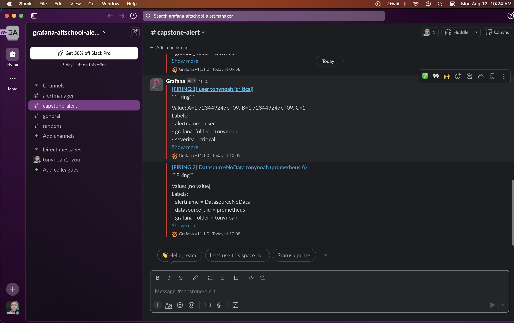

# Deploying the Sock-Shop Microservice on a Kubernetes Cluster

## Objectives

1. Establish a deployment pipeline.
2. Set up metrics collection using Alertmanager.
3. Implement monitoring with Grafana.
4. Configure logging via Prometheus.
5. Use Prometheus as the monitoring tool.
6. Manage configuration using Ansible or Terraform.
7. Choose an IaaS provider of your choice.
8. Deploy the application on Kubernetes.
9. Secure the application with HTTPS using a Let’s Encrypt certificate.

## Prerequisites

- An active Azure subscription
- Install Visual Studio Code (VSCode)
- Install the following tools:
  - Azure CLI
  - kubectl
  - Helm (Kubernetes package manager)
  - Terraform

## Deployment Steps

1. **Initialize Terraform**  
   Begin by initializing Terraform in your root directory. Run `terraform plan` followed by `terraform apply` to set up your Kubernetes cluster on your chosen cloud provider.

   <!--  -->

2. **Update kubeconfig**  
   After creating the cluster, update your kubeconfig to ensure communication with the cluster.

   <!--  -->

3. **Deploy the Application**  
   Deploy the application using the deployment YAML file from the provided GitHub repository. Once deployed, verify the deployment as shown below.

   <!--  -->

4. **Verify Application Status**  
   Use the command `kubectl get pods,svc -n sock-shop` to list all available pods and services in the sock-shop namespace.

   <!--  -->

5. **Install Ingress Controller**  
   Install the NGINX ingress controller using Helm. Start by adding the NGINX repository with `helm repo add nginx https://helm.nginx.com/stable`. Update the repositories with `helm repo update`, search for the required chart using `helm search repo nginx`, and install it using `helm install ingress nginx/nginx-ingress`. Verify the installation with `kubectl get pods,svc`.

   <!--  -->

6. **Configure DNS**  
   Map your ingress external IP address to your domain name by creating an "A record" in your Namecheap dashboard. Additionally, create "CNAME" records for different pods you want to access via the browser.

   <!--  -->

7. **Apply Ingress Rule**  
   Apply your ingress rules with the command `kubectl apply -f main-ingress.yaml` or `helm install my-app/templates/main-ingress.yaml`.

   <!--  -->

8. **Access the Application**  
   Try accessing your application through the browser. You should see the Sock-Shop app, though it may initially display as "Not Secured."

   <!--  -->

9. **Set Up Let’s Encrypt Certificate**  
   Install the cert-manager by adding the Jetstack repo with `helm repo add jetstack https://charts.jetstack.io --force-update` and applying the cert-manager YAML file using `kubectl apply -f https://github.com/cert-manager/cert-manager/releases/download/v1.15.2/cert-manager.yaml`.

   <!--  -->

10. **Create Issuer and Certificate**  
    Create an issuer or cluster issuer configuration and a certificate YAML file. Ensure your main ingress is correctly annotated with your TLS configuration. Apply the ingress first, followed by the issuer, and then the certificate request. Check the certificate status using `kubectl get certificate -n sock-shop`.

    <!--  -->
    <!--  -->

11. **Test HTTPS Encryption**  
    Test your page to confirm successful encryption. Your site should now be secured.

    <!--  -->

12. **Deploy Monitoring and Logging**  
    Use Helm to add the Prometheus community repo with `helm repo add prometheus-community https://prometheus-community.github.io/helm-charts`. Search the repo with `helm search repo prometheus`, and install the desired chart using `helm install prome prometheus-community/kube-prometheus-stack -n sock-shop`. Verify the deployment with `kubectl get pods,svc -n sock-shop`.

    <!--  -->
    <!--  -->

13. **Access Grafana and Prometheus Dashboards**  
    Update your main-ingress.yaml file to access the Grafana and Prometheus dashboards. Retrieve the default username and password for Grafana using the commands to get the Grafana pod name and then describe it.

    <!--  -->
    <!--  -->

14. **Log in to Grafana**  
    Use the retrieved credentials to log in to the Grafana dashboard.

    <!--  -->

    For Prometheus, no login is required—simply launch it in your browser.

    <!--  -->

15. **Configure Alerting with Slack**  
    Set up Slack notifications in Grafana by configuring an alerting rule. Ensure you have a Slack workspace and webhook API set up, which will be used when configuring alerts in Grafana.

    <!--  -->
